## Laporan Praktikum - 05

|       | Pemrograman Berbasis Framework 2024 |
| ----- | ----------------------------------- |
| NIM   | 2141720222                          |
| Nama  | Diwa Arsyad Atthoriq                |
| Kelas | TI - 3A                             |

### Praktikum 1

Home

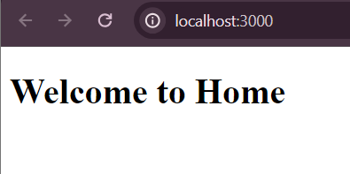

About

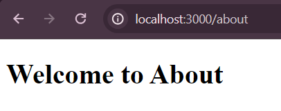

Todo: Buatlah halaman /profile yang menampilkan isi biodata anda dengan menggunakan routing di NextJS.

Profile

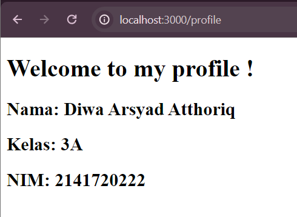

### Praktikum 2

blog

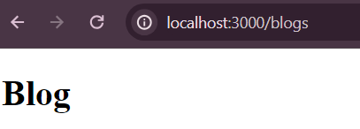

First Blog

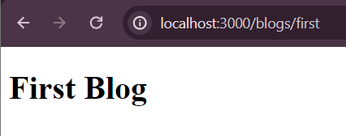

Second Blog

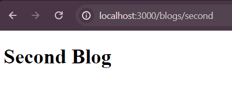

Pertanyaan: Apa kekurangan yang mungkin terjadi jika menggunakan pendekatan pada Praktikum 2 untuk menangani routing?

Kekurangan yang mungkin terjadi jika menggunakan pendekatan praktikum 2 (nested routing) untuk menangani routing:

1. **Keterbatasan Navigasi**: Pengguna mungkin mengalami kesulitan dalam navigasi karena tingkat kedalaman yang tinggi dari nested routing.

2. **Kebingungan Pengguna**: Nested routing dapat menyebabkan kebingungan pengguna karena susunan yang rumit dari link yang bersarang.

3. **Kesulitan dalam Pengelolaan**: Menambahkan dan mengelola susunan link yang bersarang dapat menjadi sulit dan memakan waktu.

4. **Kinerja yang Buruk**: Nested routing dapat mengakibatkan kinerja yang buruk terutama jika terlalu banyak link bersarang yang harus ditangani oleh server.

Penting untuk mempertimbangkan kekurangan-kekurangan ini dan memilih pendekatan routing yang sesuai dengan kebutuhan spesifik dan karakteristik jaringan Anda.

### Praktikum 3

Products

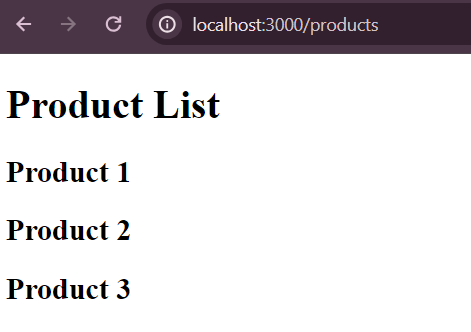

ProductsId

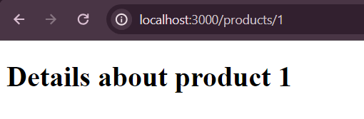

Todo 1: Perbaiki implementasi Praktikum 2 menggunakan Dynamic Routes

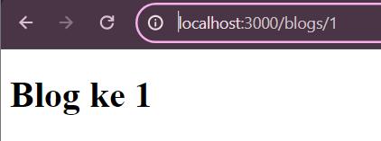

Todo 2: Dengan menggunakan konsep Nested Routes dan Dynamic Routes, buatlah halaman dengan routing /products/[productId]/reviews/[reviewId]

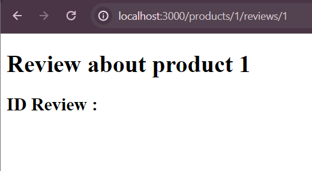

### Praktikum 4

Home

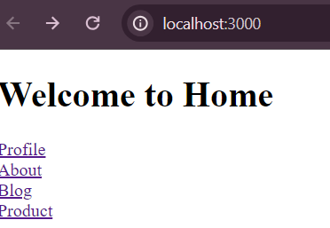

Todo: Tambahkan link yang sebelumnya anda telah kerjakan!

Profile

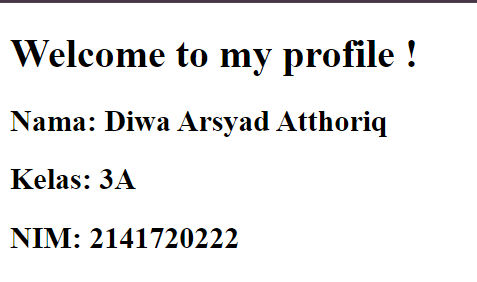

About

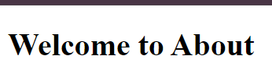

Blog

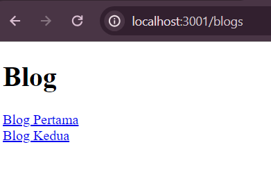

Product

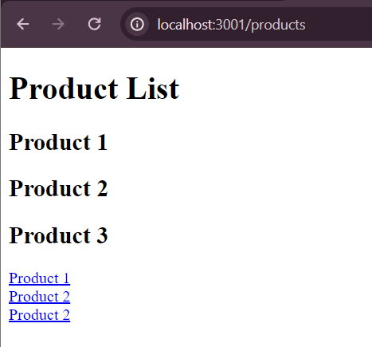

Review

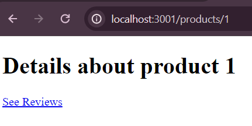
